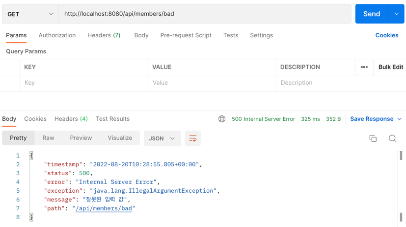
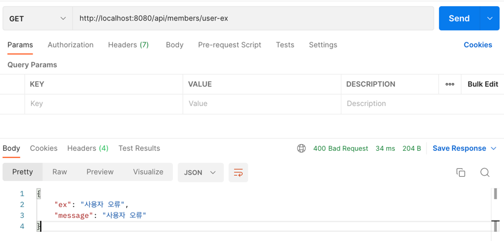
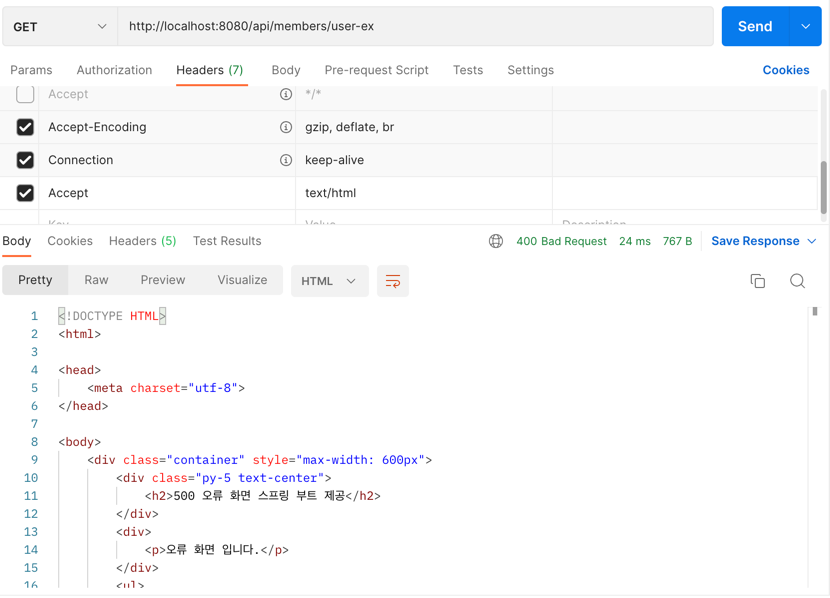
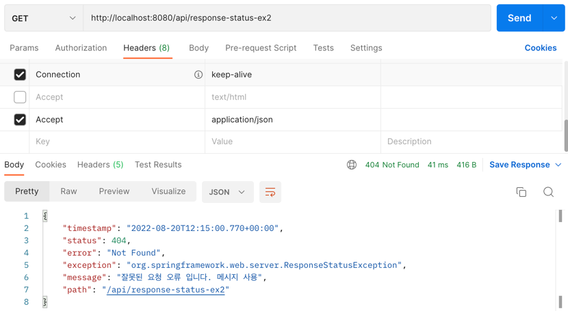

# 👻 exception
## MVC 2편(김영한)
**목표: 예외 처리와, 오류 페이지를 구현하고 이해하자.**

## 서블릿 예외 처리
### 시작
서블릿은 2가지 방식으로 예외 처리를 지원한다.
* Exception
* response.sendError(HTTP 상태 코드, 오류 메시지)

### Exception(예외)
**자바 직접 실행**

자바의 메인 메서드를 직접 실행하는 경우 `main` 이라는 이름의 스레드 실행한다.
실행 도중에 예외를 잡지 못하고 처음 실행한 `main()` 메서드를 넘어서 예외가 발생하면, 예외 정보를 남기고 스레드는 종료
1. 예외 발생
2. main() 예외 처리 X
3. 스레드 종료

**웹애플리케이션**

**웹 애플리케이션은 사용자 요청별로 별도의 스레드가 할당**되고, 서블릿 컨테이너 안에서 실행된다.
애플리케이션에서 예외가 발생했는데, `try ~ catch` 로 예외를 잡아서 처리하면 아무런 문제가 없다.
만약 예외를 처리하지 못하면???

```text
WAS (여기까지 전파) <- 필터 <- 서블릿 <- 인터셉터 <- 컨트롤러(예외발생)
```
`Exception` 의 경우에는 서버 내부에서 처리할 수 없는 오류가 발생한 것으로 생각해서 `HTTP 상태코드 500`을 반환한다.
<br><br>

#### HttpServletResponse 의 `sendError()`

**서블릿 컨테이너에게 오류가 발생했다는 것을 전달** 할 수 있다.
* `response.sendError(HTTP 상태 코드)`
* `response.sendError(HTTP 상태 코드, 오류 메시지)`
---

```java
@GetMapping("/error-404")
public void error404(HttpServletResponse response) throws IOException {
    response.sendError(404, "404 오류!");
}
@GetMapping("/error-500")
public void error500(HttpServletResponse response) throws IOException {
    response.sendError(500);
}
```

```text
WAS(sendError 호출 기록 확인) <- 필터 <- 서블릿 <- 인터셉터 <- 컨트롤러(response.sendError())
```
1. `response.sendError()` 호출
2. `response` 내부에는 오류가 발생했다는 상태를 저장
3. 서블릿 컨테이너는 고객에게 응답 전에 `response` 에 `sendError()` 가 호출되었는지 확인
4. 호출되었다면 설정한 오류 코드에 맞추어 기본 오류 페이지를 보여준다.


---
### 오류화면 제공
서블릿 컨테이너가 제공하는 기본 예외 처리 화면은.. 좀....😅

서블릿이 제공하는 오류 화면 기능을 사용해보자!

서블릿은 Exception(예외)가 발생해서 서블릿 밖으로 전달되거나 또는 response.sendError()가 호출 되었을 때 깍각의 상황에 맞춘 오류 처리 기능을 제공한다.

스프링 부트가 제공하는 기능을 활용해서 서블릿 오류 페이지를 등록한다.

```java
@Component
public class WebServerCustomizer implements WebServerFactoryCustomizer<ConfigurableWebServerFactory> {
    @Override
    public void customize(ConfigurableWebServerFactory factory) {
        ErrorPage errorPage404 = new ErrorPage(HttpStatus.NOT_FOUND, "/error-page/404");
        ErrorPage errorPage500 = new ErrorPage(HttpStatus.INTERNAL_SERVER_ERROR, "/error-page/500");
        ErrorPage errorPageEx = new ErrorPage(RuntimeException.class, "/error-page/500");

        factory.addErrorPages(errorPage404, errorPage500, errorPageEx);
    }
}
```
* `response.sendError(404)` : `errorPage404` 호출
* `response.sendError(500)` : `errorPage500` 호출
* `RuntimeException` 또는 그 자식 타입의 예외: `errorPageEx` 호출

헤당 오류를 처리할 컨트롤러를 작성한다.

예를 들어서 `RuntimeException` 예외가
발생하면 `errorPageEx` 에서 지정한 `/error-page/500` 이 호출된다.

```java
@Slf4j
@Controller
public class ErrorPageController {
    
     @RequestMapping("/error-page/404")
     public String errorPage404(HttpServletRequest request, HttpServletResponse response) {
         log.info("errorPage 404");
         return "error-page/404";
     }
     
     @RequestMapping("/error-page/500")
     public String errorPage500(HttpServletRequest request, HttpServletResponse response) {
         log.info("errorPage 500");
         return "error-page/500";
     }
}
```
**오류 처리 View**


### 오류페이지 작동 원리
서블릿은 `Exception(예외)`가 발생해서 서블릿 밖으로 전달되거나 또는 `response.sendError()`가 호출되었을 때
설정된 오류페이지를 찾는다.

**예외 발생 흐름**
```text
WAS(여기까지 전파) <- 필터 <- 서블릿 <- 인터셉터 <- 컨트롤러(예외발생)
```

**sendError 흐름**
```text
WAS(sendError 호출 기록 확인) <- 필터 <- 서블릿 <- 인터셉터 <- 컨트롤러(response.sendError())
```

**오류 페이지 요청 흐름**
```text
WAS(/error-page/500) 다시 요청 -> 필터 -> 서블릿 -> 인터셉터 -> 컨트롤러(/error-page/500) -> View
```

**예외 발생과 오류 페이지 요청 흐름**
```text
1. WAS(여기까지 전파) <- 필터 <- 서블릿 <- 인터셉터 <- 컨트롤러(예외발생)
2. WAS `/error-page/500` 다시 요청 -> 필터 -> 서블릿 -> 인터셉터 -> 컨트롤러(/errorpage/500) -> View
```

정리하면 다음과 같다..
1. 예외가 발생해서 WAS까지 전파
2. WAS는 오류 페이지 경로를 찾아서 내부에서 오류 페이지를 호출한다. 
3. 2번으로 오류 페이지 경로로 필터, 서블릿, 인터셉터, 컨트롤러가 모두 다시 호출
<br><br>

**ErrorPageController - 오류 출력**

WAS는 오류페이지를 단순히 다시 요청만 하는 것이 아니라, 오류 정보를 `request`, `attribute`에 추가해서 넘겨준다.
 
필요하면 오류 페이지에 이렇게 전달된 오류 정보를 사용할수 있다.!
```java
@Slf4j
@Controller
public class ErrorPageController {

    @RequestMapping("/error-page/404")
    public String errorPage404(HttpServletRequest request, HttpServletResponse response) {
        log.info("errorPage 404");
        printErrorInfo(request);
        
        return "error-page/404";
    }

    @RequestMapping("/error-page/500")
    public String errorPage500(HttpServletRequest request, HttpServletResponse response) {
        log.info("errorPage 500");
        printErrorInfo(request);
        
        return "error-page/500";
    }

    @RequestMapping(value = "/error-page/500", produces = MediaType.APPLICATION_JSON_VALUE)
    public ResponseEntity<Map<String, Object>> errorPage500Api(
            HttpServletRequest request, HttpServletResponse response) {
        log.info("API errorPage500");

        Map<String, Object> result = new HashMap<>();
        Exception ex = (Exception) request.getAttribute(RequestDispatcher.ERROR_EXCEPTION);
        result.put("status", request.getAttribute(RequestDispatcher.ERROR_STATUS_CODE));
        result.put("message", ex.getMessage());

        Integer statusCode = (Integer) request.getAttribute(RequestDispatcher.ERROR_STATUS_CODE);

        return new ResponseEntity<>(result, HttpStatus.valueOf(statusCode));
    }

    private void printErrorInfo(HttpServletRequest request) {
        /**
         * request.attribute에 서버가 담아준 정보
         * 
         * javax.servlet.error.exception : 예외
         * javax.servlet.error.exception_type : 예외 타입
         * javax.servlet.error.message : 오류 메시지
         * javax.servlet.error.request_uri : 클라이언트 요청 URI
         * javax.servlet.error.servlet_name : 오류가 발생한 서블릿 이름
         * javax.servlet.error.status_code : HTTP 상태 코드
         */
        log.info("ERROR_EXCEPTION: ex=", request.getAttribute(RequestDispatcher.ERROR_EXCEPTION));
        log.info("ERROR_EXCEPTION_TYPE: {}", request.getAttribute(RequestDispatcher.ERROR_EXCEPTION_TYPE));
        log.info("ERROR_MESSAGE: {}", request.getAttribute(RequestDispatcher.ERROR_MESSAGE)); //ex의 경우 NestedServletException 스프링이 한번 감싸서 반환
        log.info("ERROR_REQUEST_URI: {}", request.getAttribute(RequestDispatcher.ERROR_REQUEST_URI));
        log.info("ERROR_SERVLET_NAME: {}", request.getAttribute(RequestDispatcher.ERROR_SERVLET_NAME));
        log.info("ERROR_STATUS_CODE: {}", request.getAttribute(RequestDispatcher.ERROR_STATUS_CODE));
        log.info("dispatchType={}", request.getDispatcherType());
    }
}
```

### 필터
예외 처리에 따른 필터에 대해서 알아보자!

**예외 발생과 오류 페이지 요청 흐름**
```text
1. WAS(여기까지 전파) <- 필터 <- 서블릿 <- 인터셉터 <- 컨트롤러(예외발생)
2. WAS `/error-page/500` 다시 요청 -> 필터 -> 서블릿 -> 인터셉터 -> 컨트롤러(/errorpage/500) -> View
```
위에서 살펴본것 처럼 **오류가 발생**하면 오류 페이지를 출력하기 위해 **WAS 내부에서 다시 한번 호출이 발생**한다. 

이때 **필터, 서블릿, 인터셉터도 모두 다시 호출**된다. 

그런데 로그인 인증 체크 같은 경우를 생각해보면, 이미 한번 필터나, 인터셉터에서 로그인 체크를 완료했다. 
따라서 서버 내부에서 오류 페이지를 호출한다고 해서 해당 필터나 인터셉트가 한번 더 호출되는 것은 매우 비효율적이다.

결국 **`클라이언트로 부터 발생한 정상 요청`인지, 아니면 `오류 페이지를 출력하기 위한 내부 요청`인지 구분할 수 있어야 한다.** 

`서블릿`은 이런 문제를 해결하기 위해 `DispatcherType` 이라는 추가 정보를 제공한다.
<br><br>

**DispatcherType**
```java
public enum DispatcherType {
     FORWARD, //서블릿에서 다른 서블릿이나 JSP를 호출 할때
     INCLUDE, //서블릿에서 다른ㄹ 서블릿이나 JSP의 결과를 포함할 때
     REQUEST, //클라이언트 요청
     ASYNC,   //서블릿 비동기 호출
     ERROR    //오류 요청
}
```

**DispatcherType 활용**
```java
@Slf4j
public class LogFilter implements Filter {

    @Override
    public void init(FilterConfig filterConfig) throws ServletException {
        log.info("log filter init");
    }
    @Override
    public void doFilter(ServletRequest request, ServletResponse response, FilterChain chain) throws IOException, ServletException {
        HttpServletRequest httpRequest = (HttpServletRequest) request;
        String requestURI = httpRequest.getRequestURI();
        String uuid = UUID.randomUUID().toString();

        try {
            //로그를 출력하는 부분에 request.getDispatcherType() 을 추가
            log.info("REQUEST [{}][{}][{}]", uuid, request.getDispatcherType(), requestURI);
            chain.doFilter(request, response);
        } catch (Exception e) {
            log.info("EXCEPTION {}", e.getMessage());
            throw e;
        } finally {
            //로그를 출력하는 부분에 request.getDispatcherType() 을 추가
            log.info("RESPONSE [{}][{}][{}]", uuid, request.getDispatcherType(), requestURI);
        }
    }
    @Override
    public void destroy() {
        log.info("log filter destroy");
    }
}
```

```java
@Configuration
public class WebConfig implements WebMvcConfigurer {
    
    @Bean
    public FilterRegistrationBean logFilter() {
        FilterRegistrationBean<Filter> filterRegistrationBean = new FilterRegistrationBean<>();
        filterRegistrationBean.setFilter(new LogFilter());
        filterRegistrationBean.setOrder(1);
        filterRegistrationBean.addUrlPatterns("/*");
        // DispatcherType.REQUEST, DispatcherType.ERROR
        // 이렇게 두 가지를 모두 넣으면 클라이언트 요청은 물론이고, 오류 페이지 요청에서도 필터가 호출
        filterRegistrationBean.setDispatcherTypes(DispatcherType.REQUEST, DispatcherType.ERROR);

        return filterRegistrationBean;
    }
}
```
`filterRegistrationBean.setDispatcherTypes();`

아무것도 넣지 않으면 **기본 값이 `DispatcherType.REQUEST`** 이다. 
즉 **클라이언트의 요청이 있는 경우에만 필터가 적용된다.**

특별히 오류 페이지 경로도 필터를 적용할 것이 아니면, 기본 값을 그대로 사용하면 된다.
물론 **오류 페이지 요청 전용 필터를 적용하고 싶으면 `DispatcherType.ERROR`** 만 지정


### 인터셉터
**인터셉터는** 서블릿이 제공하는 기능이 아니라 스프링이 제공하는 기능이다. 
따라서 **`DispatcherType` 과 무관하게 항상 호출**된다.

대신에 인터셉터는 다음과 같이 요청 경로에 따라서 추가하거나 제외하기 쉽게 되어 있기 때문에, 
이러한 설정을 사용해서 **오류 페이지 경로를 `excludePathPatterns` 를 사용해서 빼주면 된다.**

```java
@Configuration
public class WebConfig implements WebMvcConfigurer {
    //@Bean
    public FilterRegistrationBean logFilter() {
        FilterRegistrationBean<Filter> filterRegistrationBean = new FilterRegistrationBean<>();
        filterRegistrationBean.setFilter(new LogFilter());
        filterRegistrationBean.setOrder(1);
        filterRegistrationBean.addUrlPatterns("/*");
        filterRegistrationBean.setDispatcherTypes(DispatcherType.REQUEST, DispatcherType.ERROR);

        return filterRegistrationBean;
    }

    @Override
    public void addInterceptors(InterceptorRegistry registry) {
        registry.addInterceptor(new LogInterceptor())
                .order(1)
                .addPathPatterns("/**")
                //여기에서 /error-page/** 를 제거하면 error-page/500 같은 내부 호출의 경우에도 인터셉터가 호출
                .excludePathPatterns("/css/**", "/*.ico", "/error", "/error-page/**"); //오류페이지 경로
    }
}
```

```java
@Slf4j
public class LogInterceptor implements HandlerInterceptor {
    public static final String LOG_ID = "logId";

    @Override
    public boolean preHandle(HttpServletRequest request, HttpServletResponse response, Object handler) throws Exception {
        String requestURI = request.getRequestURI();
        String uuid = UUID.randomUUID().toString();
        log.info("REQUEST [{}] [{}] [{}] [{}] [{}]", uuid, request.getDispatcherType(), requestURI, handler);

        return true;
    }

    @Override
    public void postHandle(HttpServletRequest request, HttpServletResponse response, Object handler, ModelAndView modelAndView) throws Exception {
        log.info("postHandle [{}]", modelAndView);
    }

    @Override
    public void afterCompletion(HttpServletRequest request, HttpServletResponse response, Object handler, Exception ex) throws Exception {
        String requestURI = request.getRequestURI();
        String logId = (String)request.getAttribute(LOG_ID);

        log.info("RESPONSE [{}][{}][{}]", logId, request.getDispatcherType(),
                requestURI);
        if (ex != null) {
            log.error("afterCompletion error!!", ex);
        }
    }
}
```

전체 흐름 정리하면 다음과 같다.

**`/hello` 정상 요청**
```text
WAS(/hello, dispatchType=REQUEST) -> 필터 -> 서블릿 -> 인터셉터 -> 컨트롤러 -> View
```

**`/error-ex` 오류 요청**
* **필터**는 `DispatchType` 으로 중복 호출 제거 ( `dispatchType=REQUEST` )
* **인터셉터**는 경로 정보로 중복 호출 제거( `excludePathPatterns("/error-page/**")` )
```text
1. WAS(/error-ex, dispatchType=REQUEST) -> 필터 -> 서블릿 -> 인터셉터 -> 컨트롤러
2. WAS(여기까지 전파) <- 필터 <- 서블릿 <- 인터셉터 <- 컨트롤러(예외발생)
3. WAS 오류 페이지 확인
4. WAS(/error-page/500, dispatchType=ERROR) -> 필터(x) -> 서블릿 -> 인터셉터(x) -> 컨트롤러(/error-page/500) -> View
```

## 스프링부트
### BasicErrorController1
앞에서 우리는 예외 처리 페이지를 만들기 위해서 복잡한 과정을 거쳤다.
1. WebServerCustomizer 구현
2. 예외 종류에 따라서 ErrorPage 구현
3. 예외 처리용 컨트롤러 ErrorPageController 구현

### 💫 놀랍게도 스프링은 이러한 모든 기능을 기본으로 제공한다.!! 😍
* `ErrorPage` 를 자동으로 등록한다. 이때 `/error` 라는 경로로 기본 오류 페이지를 설정한다.
  * `new ErrorPage("/error")` , **상태코드와 예외를 설정하지 않으면 기본 오류 페이지로 사용**된다.
  * **서블릿 밖으로 예외**가 발생하거나, **`response.sendError(...)` 가 호출**되면 모든 오류는 **`/error` 를 호출**하게 된다.
* `BasicErrorController` 라는 스프링 컨트롤러를 자동으로 등록한다.
  * `ErrorPage` 에서 등록한 /error 를 매핑해서 처리하는 컨트롤러다.
> `ErrorMvcAutoConfiguration` 이라는 클래스가 오류 페이지를 자동으로 등록하는 역할

스프링 부트가 자동 등록한 `BasicErrorController` 는 이 경로(`/error`)를 기본으로 받는다.

`BasicErrorController` 는 기본적인 로직이 모두 개발되어 있다..!!

개발자는 오류 페이지 화면만 `BasicErrorController` 가 제공하는 룰과 **우선순위에 따라서 등록하면
된다.**

정적 HTML이면 정적 리소스, 뷰 템플릿을 사용해서 동적으로 오류 화면을 만들고 싶으면 뷰 템플릿 경로에 오류 페이지 파일을 만들어서 넣어두기만 하면 된다.
<br><br>

**뷰 선택 우선순위**

`BasicErrorController` 의 처리 순서

_(구체적인 것이 덜 구체적인 것보다 우선순위 높음!)_
1. 뷰 템플릿
  * `resources/templates/error/500.html`
  * `resources/templates/error/5xx.html`
2. 정적 리소스( `static` , `public` )
  * `resources/static/error/400.html`
  * `resources/static/error/404.html`
  * `resources/static/error/4xx.html`
3. 적용 대상이 없을 때 뷰 이름( `error` )
  * `resources/templates/error.html`


### BasicErrorController2
`BasicErrorController` 가 제공하는 기본 정보들에 대해서 알아보자.

`BasicErrorController` 컨트롤러는 다음 정보를 `model` 에 담아서 뷰에 전달한다. 
뷰 템플릿은 이 값을 활용해서 출력할 수 있다.

```java
* timestamp: Fri Feb 05 00:00:00 KST 2021
* status: 400
* error: Bad Request
* exception: org.springframework.validation.BindException
* trace: 예외 trace
* message: Validation failed for object='data'. Error count: 1
* errors: Errors(BindingResult)
* path: 클라이언트 요청 경로 (`/hello`)
```

```html
<!DOCTYPE HTML>
<html xmlns:th="http://www.thymeleaf.org">
<head>
  <meta charset="utf-8">
</head>
<body>
<div class="container" style="max-width: 600px">
  <div class="py-5 text-center">
    <h2>500 오류 화면 스프링 부트 제공..!</h2>
  </div>
  <div>
    <p>오류 화면 입니다.</p>
  </div>
  <ul>
    <li>오류 정보</li>
    <ul>
      <li th:text="|timetamp: ${timestamp}|"></li>
      <li th:text="|path: ${path}|"></li>
      <li th:text="|status: ${status}|"></li>
      <li th:text="|message: ${message}|"></li>
      <li th:text="|error: ${error}|"></li>
      <li th:text="|exception: ${exception}|"></li>
      <li th:text="|trace: ${trace}|"></li>
    </ul>
  </ul>

  <hr class="my-4">
</div> <!-- /container -->
</body>
</html>
```

오류 관련 정보들을 고객에게 노출하는 것은 좋지 않다.

그래서 `BasicErrorController` 오류 컨트롤러에서 다음 오류 정보를 `model` 에 포함할지 여부 선택할 수 있다.
```properties
server.error.include-exception=true
server.error.include-message=on_param
server.error.include-stacktrace=on_param
server.error.include-binding-errors=on_param

# 오류 처리 화면을 못 찾을 시, 스프링 whitelabel 오류 페이지 적용
server.error.whitelabel.enabled=true
```
* `never` : 사용하지 않음
* `always` :항상 사용
* `on_param` : 파라미터가 있을 때 사용

## API 예외 처리
### 시작
앞서 서블릿 예외처리에 대해서 배웠다. 

그렇다면.
API 예외 처리는 어떻게 해야할까?

HTML 페이지의 경우 4xx, 5xx와 같은 오류 페이지만 있으면 대부분의 문제를 해결할 수 있다.
그런데 API의 경우에는 생각할 내용이 훨씬 많다..!

왜냐하면, 오류페이지의 경우 단순히 고객에게 오류페이지만 보여주고 끝이지만
**API는 각 상황에 맞는 오류 응답 스펙을 정하고, JSON으로 데이터를 내려주어야 한다.**

먼저 서블릿 오류 페이지 방식을 사용해서 API예외를 처리해 보자..!🤗
```java
@Component
public class WebServerCustomizer implements WebServerFactoryCustomizer<ConfigurableWebServerFactory> {
  @Override
  public void customize(ConfigurableWebServerFactory factory) {
    ErrorPage errorPage404 = new ErrorPage(HttpStatus.NOT_FOUND, "/error-page/404");
    ErrorPage errorPage500 = new ErrorPage(HttpStatus.INTERNAL_SERVER_ERROR, "/error-page/500");
    ErrorPage errorPageEx = new ErrorPage(RuntimeException.class, "/error-page/500");

    factory.addErrorPages(errorPage404, errorPage500, errorPageEx);
  }
}
```
`WAS`에 예외가 전달되거나, `response.sendError()` 가 호출되면 위에 등록한 예외 페이지 경로가 호출된다.
<br><br>

**ApiExceptionController - API 예외 컨트롤러**

예외 테스트를 위해 URL에 전달된 id 의 값이 ex 이면 예외가 발생하도록 코드를 심어두었다.

`HTTP Header`에 `Accept` 가 `application/json` 인 것을 반드시 확인`!!!!!!!!!!`
```java
@Slf4j
@RestController
public class ApiExceptionController {

    @GetMapping("/api/members/{id}")
    public MemberDto getMember(@PathVariable("id") String id) {
        if(id.equals("ex")) {
            throw new RuntimeException("잘못된 사용자");
        }
        if(id.equals("bad")) {
            throw new IllegalArgumentException("잘못된 입력 값");
        }
        if(id.equals("user-ex")) {
            throw new UserException("사용자 오류");
        }
        return new MemberDto(id, "hello "+id);
    }

    @Data
    @AllArgsConstructor
    static class MemberDto {
        private String memberId;
        private String name;
    }
}
```

이렇게 코드를 작성한뒤 API를 요청하면,

* 정상의 경우 
  * API로 JSON 형식으로 데이터가 정상반환 된다.
* 오류인 경우
  * HTML 오류 페이지 반환

우리는 웹 브라우저아닌 이상 HTML을 직접 받아서 할 수 있는 것을 별로 없다..
따라서 **`JSON 응답`을 할 수 있도록 수정해야 한다.**

**ErrorPageController - API 응답 추가**
```java
@Slf4j
@Controller
public class ErrorPageController {
    
    @RequestMapping(value = "/error-page/500", produces = MediaType.APPLICATION_JSON_VALUE)
    public ResponseEntity<Map<String, Object>> errorPage500Api(
            HttpServletRequest request, HttpServletResponse response) {
      log.info("API errorPage500");
  
      Map<String, Object> result = new HashMap<>();
      Exception ex = (Exception) request.getAttribute(RequestDispatcher.ERROR_EXCEPTION);
      result.put("status", request.getAttribute(RequestDispatcher.ERROR_STATUS_CODE));
      result.put("message", ex.getMessage());
  
      Integer statusCode = (Integer) request.getAttribute(RequestDispatcher.ERROR_STATUS_CODE);
  
      return new ResponseEntity<>(result, HttpStatus.valueOf(statusCode));
    }
}
```
`produces = MediaType.APPLICATION_JSON_VALUE` 의 뜻은 클라이언트가 요청하는 HTTP Header의
Accept 의 값이 application/json 일 때 해당 메서드가 호출된다는 것이다. 
결국 클라어인트가 받고 싶은 미디어타입이 JSON 이에 이 컨트롤러의 메서드가 호출된다.

`http://localhost:8080/api/members/ex`


**동작 순서**
```text
1. WAS(/api/members/ex, Accept: application/json) -> 필터 -> 서블릿 -> 인터셉터 -> 컨트롤러
2. WAS(여기까지 전파) <- 필터 <- 서블릿 <- 인터셉터 <- 컨트롤러(RuntimeException 예외발생)
3. WAS 오류 페이지 확인
4. WAS(/error-page/500) -> 필터(x) -> 서블릿 -> 인터셉터(x) -> 컨트롤러(/error-page/500, HTTP 메시지 컨버터(ReturnValueHandler))
```
### 스프링 부트 기본 오류 처리
API 예외 처리도 스프링 부트가 제공하는 기본 오류 방식을 사용할 수 있다.

스프링 부트가 제공하는 `BasicErrorController` 코드를 보자.
<br><br>

**BasicErrorController**
```java
@Controller
@RequestMapping("${server.error.path:${error.path:/error}}")
public class BasicErrorController extends AbstractErrorController {

    private final ErrorProperties errorProperties;
  
    public BasicErrorController(ErrorAttributes errorAttributes, ErrorProperties errorProperties,
                                List<ErrorViewResolver> errorViewResolvers) {
        super(errorAttributes, errorViewResolvers);
        Assert.notNull(errorProperties, "ErrorProperties must not be null");
        this.errorProperties = errorProperties;
    }
  
    @RequestMapping(produces = MediaType.TEXT_HTML_VALUE)
    public ModelAndView errorHtml(HttpServletRequest request, HttpServletResponse response) {
        HttpStatus status = getStatus(request);
        Map<String, Object> model = Collections
                .unmodifiableMap(getErrorAttributes(request, getErrorAttributeOptions(request, MediaType.TEXT_HTML)));
        response.setStatus(status.value());
        ModelAndView modelAndView = resolveErrorView(request, response, status, model);
        
        return (modelAndView != null) ? modelAndView : new ModelAndView("error", model);
    }
  
    @RequestMapping
    public ResponseEntity<Map<String, Object>> error(HttpServletRequest request) {
        HttpStatus status = getStatus(request);
        
        if (status == HttpStatus.NO_CONTENT) {
            return new ResponseEntity<>(status);
        }
        Map<String, Object> body = getErrorAttributes(request, getErrorAttributeOptions(request, MediaType.ALL));
        
        return new ResponseEntity<>(body, status);
    }
  
    @ExceptionHandler(HttpMediaTypeNotAcceptableException.class)
    public ResponseEntity<String> mediaTypeNotAcceptable(HttpServletRequest request) {
        HttpStatus status = getStatus(request);
        
        return ResponseEntity.status(status).build();
    }
}
```
`@RequestMapping("${server.error.path:${error.path:/error}}")`

`/error` 동일한 경로를 처리하는 `errorHtml()`, `error()` 두 메서드를 확인할 수 있다.

* `errorHtml()` : `produces = MediaType.TEXT_HTML_VALUE` 클라이언트 요청의 Accept 해더 값이 `text/html` 인 경우에는 `errorHtml()`을 호출해서 `view`를 제공한다.
* `error()` : 그외 경우에 호출되고 `ResponseEntity` 로 `HTTP Body` 에 `JSON 데이터` 를 반환한다.

<br><br>

**스프링 부트의 예외 처리**

앞서 학습했듯이 스프링 부트의 기본 설정은 오류 발생시 `/error` 를 오류 페이지로 요청한다.
`BasicErrorController` 는 이 경로를 기본으로 받는다. ( `server.error.path 로 수정 가능, 기본 경로 /error` )

`GET http://localhost:8080/api/members/ex`

**주의**

`BasicErrorController` 를 사용하도록 `WebServerCustomizer` 의 `@Component` 를 주석처리 하자.


스프링 부트는 `BasicErrorController` 가 제공하는 기본 정보들을 활용해서 오류 API를 생성해준다.

다음 옵션들을 설정하면 더 자세한 오류 정보를 추가할 수 있다.
```properties
server.error.include-binding-errors=always
server.error.include-exception=true
server.error.include-message=always
server.error.include-stacktrace=always
```

**API 예외 처리는 @ExceptionHandler 를 사용하자!**

`BasicErrorController` 는 HTML 페이지를 제공하는 경우에는 매우 편리하다.
`4xx`, `5xx` 등등 모두 잘 처리해준다. 

그런데 API 오류 처리는 다른 차원의 이야기이다. API 마다, 각각의 컨트롤러나 예외마다 서로 다른 응답 결과를 출력해야 할 수도 있다. 

예를 들어서 회원과 관련된 API에서 예외가 발생할 때 응답과, 상품과 관련된 API에서 발생하는 예외에 따라 그 결과가 달라질 수 있다.
결과적으로 매우 세밀하고 복잡하다. 

따라서 이 방법은 HTML 화면을 처리할 때 사용하고, API 오류 처리는 `@ExceptionHandler` 를 사용

* 정리
  * HTML 예외처리 -> `BasicErrorController`
  * API 예외처리 -> `@ExceptionHandler`

### HandlerExceptionResolver 시작
> 오류 메시지, 형식등을 API 마다 다르게 처리하고 싶다.!

예외가 발생해서 서블릿을 넘어 WAS 까지 예외가 절단되면 HTTP 상태코드가 500으로 처리된다.

발생하는 예외에 따라서 400, 404 등등 다른 상태코드로 처리하고 싶다.

즉, 오류 메시지, 형식등을 API 마다 다르게 처리하고 싶다.!

예를 들어서 `IllegalArgumentException을` 처리하지 못해서 
컨트롤러 밖으로 넘어가는 일이 발생하면 HTTP 상태코드를 400으로 처리하고 싶다.

**ApiExceptionController - 수정**
```java
@GetMapping("/api/members/{id}")
public MemberDto getMember(@PathVariable("id") String id) {
    if(id.equals("ex")) {
        throw new RuntimeException("잘못된 사용자");
    }
    if(id.equals("bad")) {
        throw new IllegalArgumentException("잘못된 입력 값");
    }
    return new MemberDto(id, "hello "+id);
}
```
<br>

실행하면 상태코드가 500인 것을 확인 할 수 있다.



<br><br>

**HandlerExceptionResolver**

> 컨트롤러 밖으로 던져진 예외 해결해줘!!

스프링 MVC는 컨트롤러(핸들러) 밖으로 예외가 던져진 경우 예외를 해결하고, 동작을 새로 정의할 수 있는 방법을 제공한다..!
**컨트롤러 밖으로 던져진 예외를 해결하고, 동작 방식을 변경하고 싶으면 `HandlerExceptionResolver (ExceptionResolver)` 를 사용**하면 된다.

**ExceptionResolver 사용전**


**ExceptionResolver 적용 후**


**`ExceptionResolver` 적용해도 `postHandle()`은 호출되지 않는다.**

**HandlerExceptionResolver - 인터페이스**
```java
public interface HandlerExceptionResolver {
   ModelAndView resolveException(
           HttpServletRequest request, HttpServletResponse response, 
            Object handler, Exception ex);
}
```
* `handler` : 핸들러(컨트롤러) 정보
* `Exception ex` : 핸들러(컨트롤러)에서 발생한 발생한 예외

예외가 발생하면 WAS까지 예외가 던져지고, WAS에서 오류 페이지 정보를 찾아서 다시 `/error`를 호출하는 과정은 생각해보면 너무 복잡하다...
`ExceptionResolver` 를 활용하면 예외가 발생했을 때 이런 복잡한 과정 없이 문제를 해결 할수 있다.

`HandlerExceptionResolver` 인터페이스를 상속받아서 `MyHandlerExceptionResolver를` 구현하자.

**MyHandlerExceptionResolver**
```java
@Slf4j
public class MyHandlerExceptionResolver implements HandlerExceptionResolver {
  @Override
  public ModelAndView resolveException(HttpServletRequest request, HttpServletResponse response, Object handler, Exception ex) {
    //ex의 클래스 타입 확인
    if (ex instanceof IllegalArgumentException) {
      try {
        log.info("IllegalArgumentException resolver to 400");
        //상태 코드를 400으로~
        response.sendError(HttpServletResponse.SC_BAD_REQUEST, ex.getMessage());
        //정상 흐름 처럼 변경(빈 ModelAndView 반환)
        return new ModelAndView();
      } catch (IOException e) {
        log.error("resolver ex", e);
      }
    }
    /**
     * null을 반환하면 다음 ExceptionResolver 를 찾아서 실행!
     * 만약 다음 ExceptionResolver 가 없으면 예외처리가 안되고, 
     * 기존에 발생한 예외를 서블릿 밖으로~
     */
    return null;
  }
}
```
⭐️ ️`HandlerExceptionResolver` 가 `ModelAndView` 를 반환하는 이유는 
마치 `try ~ catch` 를 하듯이, `Exception` 을 처리해서 **정상 흐름 처럼 변경하는 것이 목적**이다.
  * `IllegalArgumentException` 이 발생하면 `response.sendError(400)` 를 호출해서 HTTP
    상태 코드를 400으로 지정하고, 빈 `ModelAndView` 를 반환
<br><br>

**⭐️ `HandlerExceptionResolver` 의 반환 값에 따른 `DispatcherServlet` 의 동작 방식**

* `빈 ModelAndView`: `new ModelAndView()` 처럼 빈 `ModelAndView` 를 반환하면 뷰를 렌더링 하지 않고, 정상 흐름으로 서블릿이 리턴
* `ModelAndView 지정`: `ModelAndView` 에 `View`, `Model` 등의 정보를 지정해서 반환하면 뷰를 렌더링 한다.
* `null`: `null` 을 반환하면, 다음 `ExceptionResolver` 를 찾아서 실행한다. 만약 처리할 수 있는
  `ExceptionResolver` 가 없으면 예외 처리가 안되고, 기존에 발생한 예외를 서블릿 밖으로 던진다.

### HandlerExceptionResolver 활용
* **예외 상태 코드 변환**
  * 예외를 `response.sendError(xxx)` 호출로 변경해서 서블릿에서 상태 코드에 따른 오류를 처리하도록 위임
  * 이후 **WAS**는 서블릿 오류 페이지를 찾아서 내부 호출, 예를 들어서 스프링 부트가 기본으로 설정한 `/error` 가 호출됨
* **뷰 템플릿 처리**
  * `ModelAndView` 에 값을 채워서 예외에 따른 새로운 오류 화면 뷰 렌더링 해서 고객에게 제공
* **API 응답 처리**
  * `response.getWriter().println("hello");` 처럼 HTTP 응답 바디에 직접 데이터를 넣어주는
  것도 가능하다. 여기에 **JSON 으로 응답하면 API 응답 처리를 할 수 있다.**

자 이제 500을 400으로 바꿔보자~

```java
@Configuration
public class WebConfig implements WebMvcConfigurer {
  //@Bean
  public FilterRegistrationBean logFilter() {
    FilterRegistrationBean<Filter> filterRegistrationBean = new FilterRegistrationBean<>();
    filterRegistrationBean.setFilter(new LogFilter());
    filterRegistrationBean.setOrder(1);
    filterRegistrationBean.addUrlPatterns("/*");
    filterRegistrationBean.setDispatcherTypes(DispatcherType.REQUEST, DispatcherType.ERROR);

    return filterRegistrationBean;
  }

  //추가
  @Override
  public void extendHandlerExceptionResolvers(List<HandlerExceptionResolver> resolvers) {
    resolvers.add(new MyHandlerExceptionResolver());
  }
}
```
`configureHandlerExceptionResolvers(..)` 를 사용하면 스프링이 기본으로 등록하는
`ExceptionResolver` 가 제거되므로 주의, `extendHandlerExceptionResolvers` 를 사용하자.

**HTTP 상태 코드 500에서 400으로 바뀐것**을 확인 할 수 있다.


**API 예외 처리 - `HandlerExceptionResolver` 활용**

먼저 사용자 정의 예외를 하나 추가하자.!
```java
public class UserException extends RuntimeException {
    public UserException() {
        super();
    }

    public UserException(String message) {
        super(message);
    }

    public UserException(String message, Throwable cause) {
        super(message, cause);
    }

    public UserException(Throwable cause) {
        super(cause);
    }

    protected UserException(String message, Throwable cause, boolean enableSuppression, boolean writableStackTrace) {
        super(message, cause, enableSuppression, writableStackTrace);
    }
}
```

**ApiExceptionController - 예외 추가**
```java
@Slf4j
@RestController
public class ApiExceptionController {

  @GetMapping("/api/members/{id}")
  public MemberDto getMember(@PathVariable("id") String id) {
    if (id.equals("ex")) {
      throw new RuntimeException("잘못된 사용자");
    }
    if (id.equals("bad")) {
      throw new IllegalArgumentException("잘못된 입력 값");
    }
    //추가(API 예외 처리)
    if (id.equals("user-ex")) {
      throw new UserException("사용자 오류");
    }
    return new MemberDto(id, "hello " + id);
  }

  @Data
  @AllArgsConstructor
  static class MemberDto {
    private String memberId;
    private String name;
  }
}
```

이제 이 예외를 처리하는 `UserHandlerExceptionResolver` 를 만들어보자.

**UserHandlerExceptionResolver**
```java
@Slf4j
public class UserHandlerExceptionResolver implements HandlerExceptionResolver {

    private final ObjectMapper objectMapper = new ObjectMapper();

    @Override
    public ModelAndView resolveException(HttpServletRequest request, HttpServletResponse response, Object handler, Exception ex) {
        try{
            if(ex instanceof UserException) {
                log.info("UserException resolver to 400");
                String acceptHeader = request.getHeader("accept");
                response.setStatus(HttpServletResponse.SC_BAD_REQUEST);
              /**
               * HTTP 요청 해더의 ACCEPT 값이 application/json 이면 JSON으로 오류를 내려주고, 
               * 그 외 경우에는 error/500에 있는 HTML 오류 페이지를 보여준다
               */
              if("application/json".equals(acceptHeader)) {
                    Map<String, Object> errorResult = new HashMap<>();
                    errorResult.put("ex", ex.getMessage());
                    errorResult.put("message", ex.getMessage());

                    String result = objectMapper.writeValueAsString(errorResult); //json to String

                    response.setContentType(MediaType.APPLICATION_JSON_VALUE);
                    response.setCharacterEncoding("utf-8");
                    response.getWriter().write(result);

                    return new ModelAndView(); //예외는 먹어버리고 정상 호출됨
                }
                else {
                    return new ModelAndView("error/500");
                }
            }
        } catch (IOException e) {
            log.error("resolver ex", e);
        }

        return null;
    }
}
```
HTTP 요청 해더의 ACCEPT 값이 `application/json` 이면 JSON으로 오류를 내려주고, 그 외 경우에는
`error/500`에 있는 HTML 오류 페이지를 보여준다.

**WebConfig**
```java
@Override
public void extendHandlerExceptionResolvers(List<HandlerExceptionResolver> resolvers) {
    resolvers.add(new MyHandlerExceptionResolver());
    //추가
    resolvers.add(new UserHandlerExceptionResolver());
}
```

**ACCEPT : application/json**



**ACCEPT : text/html**



**정리**
* `ExceptionResolver` 를 사용하면 컨트롤러에서 예외가 발생해도 `ExceptionResolver` 에서 예외를
처리해버린다.
* 따라서 예외가 발생해도 서블릿 컨테이너까지 예외가 전달되지 않고, 스프링 MVC에서 예외 처리는 끝이
난다.
* 결과적으로 WAS 입장에서는 정상 처리가 된 것이다. 이렇게 **예외를 이곳에서 모두 처리할 수 있다는 것이
핵심**이다.


* 서블릿 컨테이너까지 예외가 올라가면 복잡하고 지저분하게 추가 프로세스가 실행된다. 
* 반면에 `ExceptionResolver` 를 사용하면 예외처리가 상당히 깔끔해진다.

**그런데 직접 ExceptionResolver 를 구현하려고 하니 상당히 복잡하다. 😭**

### 스프링이 제공하는 ExceptionResolver1
스프링 부트가 기본으로 제공하는 `ExceptionResolver` 는 다음과 같다.

`HandlerExceptionResolverComposite` 에 다음 순서로 등록
1. `ExceptionHandlerExceptionResolver`
2. `ResponseStatusExceptionResolver`
3. `DefaultHandlerExceptionResolver` -> 우선 순위가 가장 낮음

**💗 ExceptionHandlerExceptionResolver**

`@ExceptionHandler` 을 처리한다. 
API 예외 처리는 대부분 이 기능으로 해결한다.

**ResponseStatusExceptionResolver**

HTTP 상태 코드를 지정해준다.

e.g) `@ResponseStatus(value = HttpStatus.NOT_FOUND)`

**DefaultHandlerExceptionResolver**

스프링 내부 **기본 예외를 처리**한다.
<br><br>

먼저 가장 쉬운 `ResponseStatusExceptionResolver` 부터 알아봅시다~

**ResponseStatusExceptionResolver**
`ResponseStatusExceptionResolver` 는 예외에 따라서 HTTP 상태 코드를 지정해주는 역할을 한다.

* `@ResponseStatus` 가 달려있는 예외
* `ResponseStatusException` 예외

`reason` 을 `MessageSource` 에서 찾는 기능도 제공

```properties
error.bad=잘못된 요청 오류 입니다. 메시지 사용
```

```java
@ResponseStatus(code = HttpStatus.BAD_REQUEST, reason = "error.bad")
public class BadRequestException extends RuntimeException {
    //ResponseStatusExceptionResolver 에 걸림
}
```
`BadRequestException` 예외가 컨트롤러 밖으로 넘어가면 `ResponseStatusExceptionResolver` 예외가
해당 애노테이션을 확인해서 오류 코드를 `HttpStatus.BAD_REQUEST (400)` 으로 변경하고, 메시지도 담는다.

`ResponseStatusExceptionResolver` 코드를 확인해보면 결국 `response.sendError(statusCode, resolvedReason)` 를 호출하는 것을 확인할 수 있다.

`sendError(400)` 를 호출했기 때문에 WAS에서 다시 오류 페이지( `/error` )를 내부 요청한다.

```java
@GetMapping("/api/response-status-ex1")
public String responseStatusEx1() {
        throw new BadRequestException();
}
```


**ResponseStatusException**

`@ResponseStatus` 는 개발자가 직접 변경할 수 없는 예외에는 적용할 수 없다. 
(애노테이션을 직접 넣어야 하는데, 내가 코드를 수정할 수 없는 라이브러리의 예외 코드 같은 곳에는 적용할 수 없다.)

추가로 애노테이션을 사용하기 때문에 **조건에 따라 동적으로 변경하는 것도 어렵다.** 
이때는 `ResponseStatusException` 예외를 사용하면 된다.

```java
@GetMapping("/api/response-status-ex2")
public String responseStatusEx2() {
    throw new ResponseStatusException(HttpStatus.NOT_FOUND, "error.bad", new IllegalArgumentException());
}
```


### 스프링이 제공하는 ExceptionResolver2
**DefaultHandlerExceptionResolver**

* `DefaultHandlerExceptionResolver` 는 스프링 내부에서 발생하는 스프링 예외를 해결한다.
* 대표적으로 파라미터 바인딩 시점에 타입이 맞지 않으면 내부에서 `TypeMismatchException` 이
발생한다.
  * 이 경우 예외가 발생했기 때문에 그냥 두면 서블릿 컨테이너까지 오류가 올라가고, 결과적으로 500 오류가 발생한다.

그런데 말입니다...

**파라미터 바인딩은 대부분 클라이언트가 HTTP 요청 정보를 잘못 호출해서 발생하는 문제**이다.

* HTTP 에서는 이런 경우 HTTP 상태 코드 400을 사용하도록 되어 있다.
* `DefaultHandlerExceptionResolver` 는 이것을 500 오류가 아니라 **HTTP 상태 코드 400 오류**로 변경한다.
* 스프링 내부 오류를 어떻게 처리할지 수 많은 내용이 정의되어 있다


**코드 확인**
`DefaultHandlerExceptionResolver.handleTypeMismatch` 를 보면 다음과 같은 코드를 확인할 수 있다.

`response.sendError(HttpServletResponse.SC_BAD_REQUEST) (400)`

결국 `response.sendError()` 를 통해서 문제를 해결한다.
**`sendError(400)` 를 호출했기 때문에 WAS에서 다시 오류 페이지( `/error` )를 내부 요청**한다
```java
/**
 * Handle the case when a {@link org.springframework.web.bind.WebDataBinder} conversion error occurs.
 * <p>The default implementation sends an HTTP 400 error, and returns an empty {@code ModelAndView}.
 * Alternatively, a fallback view could be chosen, or the TypeMismatchException could be rethrown as-is.
 * @param ex the TypeMismatchException to be handled
 * @param request current HTTP request
 * @param response current HTTP response
 * @param handler the executed handler
 * @return an empty ModelAndView indicating the exception was handled
 * @throws IOException potentially thrown from {@link HttpServletResponse#sendError}
 */
protected ModelAndView handleTypeMismatch(TypeMismatchException ex,
HttpServletRequest request, HttpServletResponse response, @Nullable Object handler) throws IOException {
  response.sendError(HttpServletResponse.SC_BAD_REQUEST);
  return new ModelAndView();
}
```
**ApiExceptionController - 추가**
```java
@GetMapping("/api/default-handler-ex")
public String defaultException(@RequestParam Integer data) {
    return "ok";
}
```
`Integer data` 에 문자를 입력하면 내부에서 `TypeMismatchException` 이 발생한다.


**정리**

지금까지 다음 `ExceptionResolver` 들에 대해 알아보았다.
1. `ExceptionHandlerExceptionResolver` 다음 시간에
2. `ResponseStatusExceptionResolver` HTTP 응답 코드 변경
3. `DefaultHandlerExceptionResolver` 스프링 내부 예외 처리

지금까지 HTTP 상태 코드를 변경하고, 스프링 내부 예외의 상태코드를 변경하는 기능도 알아보았다.

**그런데 `HandlerExceptionResolver` 를 직접 사용하기는 복잡하다.** 

1. API 오류 응답의 경우 `response` 에 직접 데이터를 넣어야 해서 매우 불편하고 번거롭다.
2. `ModelAndView` 를 반환해야 하는 것도 API에는 잘 맞지 않는다.

스프링은 이 문제를 해결하기 위해 `@ExceptionHandler` 라는 매우 혁신적인 예외 처리 기능을 제공한다.

😍 그것은 바로바로바로바로바로 `ExceptionHandlerExceptionResolver` 이다.

### 스프링이 제공하는 @ExceptionHandler
**🌃 HTML 화면 오류 vs 🔡 API 오류**

웹 브라우저에 `HTML 화면`을 제공할 때는 오류가 발생하면 `BasicErrorController` 를 사용하는게
편하다.

이때는 단순히 `5xx`, `4xx` 관련된 오류 화면을 보여주면 된다. `BasicErrorController` 는 이런 메커니즘을
모두 구현해두었다.

그런데 API는 각 시스템 마다 응답의 모양도 다르고, 스펙도 모두 다르다. 예외 상황에 단순히 오류 화면을
보여주는 것이 아니라, 예외에 따라서 각각 다른 데이터를 출력해야 할 수도 있다. 
그리고 같은 예외라고 해도 어떤 컨트롤러에서 발생했는가에 따라서 다른 예외 응답을 내려주어야 할 수 있다. 

한마디로 매우 세밀한 제어가 필요하다. 
앞서 이야기했지만, 예를 들어서 **상품 API와 주문 API는 오류가 발생했을 때 응답의 모양이 완전히 다를 수 있다.**

**결국 지금까지 살펴본 `BasicErrorController` 를 사용하거나 `HandlerExceptionResolver` 를 직접
구현하는 방식으로 API 예외를 다루기는 쉽지 않다.**

**API 예외처리의 어려운 점**
* `HandlerExceptionResolver` 를 떠올려 보면 `ModelAndView` 를 반환해야 했다. 
  * 이것은 API 응답에는 필요하지 않다.
* API 응답을 위해서 `HttpServletResponse` 에 직접 응답 데이터를 넣어주었다. 
  * 이것은 매우 불편하다.
* 스프링 컨트롤러에 비유하면 마치 과거 서블릿을 사용하던 시절로 돌아간 것 같다.
* 특정 컨트롤러에서만 발생하는 예외를 별도로 처리하기 어렵다. 

예를 들어서 **회원을 처리하는 컨트롤러에서 발생하는 `RuntimeException` 예외**와 **상품을 관리하는 컨트롤러에서 발생하는 동일한`RuntimeException` 예외**를 
**서로 다른 방식으로 처리**하고 싶다면 어떻게 해야할까?
<br><br>

**@ExceptionHandler**

스프링은 API 예외 처리 문제를 해결하기 위해 `@ExceptionHandler` 라는 애노테이션을 사용하는 매우
편리한 예외 처리 기능을 제공하는데, 이것이 바로 `ExceptionHandlerExceptionResolver` 이다.
스프링은 `ExceptionHandlerExceptionResolver` 를 기본으로 제공하고, 기본으로 제공하는
`ExceptionResolver` 중에 우선순위도 가장 높다. 
실무에서 API 예외 처리는 대부분 이 기능을 사용한다.

예제로 알아보자.

API 응답 객체 정의
```java
@Data
@AllArgsConstructor
public class ErrorResult {
    private String code;
    private String message;
}
```

**ApiExceptionV2Controller**
```java
@Slf4j
@RestController
public class ApiExceptionV2Controller {

    @ResponseStatus(HttpStatus.BAD_REQUEST)
    @ExceptionHandler(IllegalArgumentException.class)
    public ErrorResult illegalExHandler(IllegalArgumentException e) {
        log.error("[IllegalArgumentException] ex", e);
        return new ErrorResult("BAD", e.getMessage());
    }

    @ExceptionHandler
    public ResponseEntity<ErrorResult> userExHandler(UserException e) {
         log.error("[UserException] ex", e);
        ErrorResult errorResult = new ErrorResult("USER-EX", e.getMessage());
        return new ResponseEntity<>(errorResult, HttpStatus.BAD_REQUEST);
    }

    @ResponseStatus(HttpStatus.INTERNAL_SERVER_ERROR)
    @ExceptionHandler
    public ErrorResult exHandler(Exception e) {
        log.error("[Exception] ex", e);
        return new ErrorResult("EX", "내부 오류");
    }

    @GetMapping("/api2/members/{id}")
    public ApiExceptionController.MemberDto getMember(@PathVariable("id") String id) {
        if(id.equals("ex")) {
            throw new RuntimeException("잘못된 사용자");
        }
        if(id.equals("bad")) {
            throw new IllegalArgumentException("잘못된 입력 값");
        }
        if(id.equals("user-ex")) {
            throw new UserException("사용자 오류");
        }
        return new ApiExceptionController.MemberDto(id, "hello "+id);
    }

    @Data
    @AllArgsConstructor
    static class MemberDto {
        private String memberId;
        private String name;
    }
}
```

**@ExceptionHandler 예외 처리 방법**

`@ExceptionHandler` 애노테이션을 선언하고, 해당 컨트롤러에서 처리하고 싶은 예외를 지정해주면 된다.
해당 컨트롤러에서 예외가 발생하면 이 메서드가 호출된다.

**참고로 지정한 예외 또는 그 예외의 자식 클래스는 모두 잡을 수 있다.**

아래 코드는 `IllegalArgumentException.class` 뿐만 아니라 그 하위 자식 클래스 까지 모두 처리 할 수 있다.
```java
@ExceptionHandler(IllegalArgumentException.class)
public ErrorResult illegalExHandle(IllegalArgumentException e) {
        log.error("[exceptionHandle] ex", e);
        return new ErrorResult("BAD", e.getMessage());
}
```
<br><br>

**우선순위**

스프링의 우선순위는 항상 자세한 것이 우선권을 가진다. 예를 들어서 부모, 자식 클래스가 있고 다음과 같이
예외가 처리된다.

```java
@ExceptionHandler(부모예외.class)
public String 부모예외처리()(부모예외 e) {}

@ExceptionHandler(자식예외.class)
public String 자식예외처리()(자식예외 e) {}
```
1. 자식예외 발생

자식 예외가 발생하면 부모, 자식 둘다 호출 대상이다.
그런데 둘중 자세한 것이 우선권을 가지므로 **자식예외가 호출**된다.

2. 부모예외 발생

부모예외가 호출되면 부모예외만 호출 대상이 되므로 **부모예외만 호출**된다.

**다양한 예외**

다음과 같이 **다양한 예외를 한번에 처리**할 수 있다.
```java
@ExceptionHandler({AException.class, BException.class})
public String ex(Exception e) {
    log.info("exception e", e);
}
```

**예외 생략**

`@ExceptionHandler` 에 예외를 생략할 수 있다. **생략하면 메서드 파라미터의 예외가 지정**된다.
```java
@ExceptionHandler
public ResponseEntity<ErrorResult> userExHandle(UserException e) {}
```

**파리미터와 응답**

`@ExceptionHandler` 에는 마치 스프링의 컨트롤러의 파라미터 응답처럼 다양한 파라미터와 응답을 지정할 수 있다.

공식 메뉴얼
* https://docs.spring.io/spring-framework/docs/current/reference/html/web.html#mvc-annexceptionhandler-args

<br><br>

자 이제 앞에서 작성한 코드들을 파헤져 보자~

**IllegalArgumentException 처리**
````java
@ResponseStatus(HttpStatus.BAD_REQUEST)
@ExceptionHandler(IllegalArgumentException.class)
public ErrorResult illegalExHandler(IllegalArgumentException e) {
    log.error("[IllegalArgumentException] ex", e);
    return new ErrorResult("BAD", e.getMessage());
}
````
**실행 흐름**

1. 컨트롤러를 호출한 결과 `IllegalArgumentException` 예외가 컨트롤러 밖으로 던져진다.
2. 예외가 발생했으로 `ExceptionResolver` 가 작동한다. 
3. 가장 우선순위가 높은 `ExceptionHandlerExceptionResolver` 가 실행된다.
4. `ExceptionHandlerExceptionResolver` 는 해당 컨트롤러에 `IllegalArgumentException` 을 처리할
수 있는 `@ExceptionHandler` 가 있는지 확인한다.
5. `illegalExHandle()` 를 실행한다. 
   1. `@RestController` 이므로 `illegalExHandle()` 에도 `@ResponseBody` 가 적용된다. 
   2. 따라서 HTTP 컨버터가 사용되고, 응답이 다음과 같은 `JSON` 으로 반환된다.
6. `@ResponseStatus(HttpStatus.BAD_REQUEST)` 를 지정했으므로 HTTP 상태 코드 `400`으로 응답한다.

**UserException 처리**
```java
@ExceptionHandler
public ResponseEntity<ErrorResult> userExHandle(UserException e) {
   log.error("[exceptionHandle] ex", e);
   ErrorResult errorResult = new ErrorResult("USER-EX", e.getMessage());
   return new ResponseEntity<>(errorResult, HttpStatus.BAD_REQUEST);
}
```
* `@ExceptionHandler` 에 예외를 지정하지 않으면 해당 메서드 파라미터 예외를 사용한다. 여기서는 `UserException` 을 사용한다.
* `ResponseEntity` 를 사용해서 HTTP 메시지 바디에 직접 응답한다. 물론 HTTP 컨버터가 사용된다.
  * `ResponseEntity` 를 사용하면 **HTTP 응답 코드를 프로그래밍해서 동적으로 변경할 수 있다.** 앞서 살펴본
  * `@ResponseStatus` 는 애노테이션이므로 HTTP 응답 코드를 동적으로 변경할 수 없다.

**Exception**
```java
@ResponseStatus(HttpStatus.INTERNAL_SERVER_ERROR)
@ExceptionHandler
public ErrorResult exHandle(Exception e) {
   log.error("[exceptionHandle] ex", e);
   return new ErrorResult("EX", "내부 오류");
}
```
* `throw new RuntimeException("잘못된 사용자")` 이 코드가 실행되면서, 컨트롤러 밖으로 `RuntimeException` 이 던져진다.
* `RuntimeException` 은 `Exception` 의 자식 클래스이다. 따라서 이 메서드가 호출된다.
* `@ResponseStatus(HttpStatus.INTERNAL_SERVER_ERROR)` 로 HTTP 상태 코드를 `500` 으로 응답한다.

**HTML 오류 화면**

`ModelAndView` 를 사용해서 오류 화면(HTML)을 응답하는데 사용할 수도 있다
```java
@ExceptionHandler(ViewException.class)
public ModelAndView ex(ViewException e) {
   log.info("exception e", e);
   return new ModelAndView("error");
}
```
### 스프링이 제공하는 @ControllerAdvice
`@ExceptionHandler` 를 사용해서 예외를 깔끔하게 처리할 수 있게 되었지만, 
정상 코드와 예외 처리 코드가 하나의 컨트롤러에 섞여 있다. 

**`@ControllerAdvice` 또는 `@RestControllerAdvice` 를 사용하면 `정상코드`와 `예외처리 코드`를 깔끔하게 `분리`할 수 있다.**

```java
@Slf4j
@RestControllerAdvice
public class ExController {

    @ResponseStatus(HttpStatus.BAD_REQUEST)
    @ExceptionHandler(IllegalArgumentException.class)
    public ErrorResult illegalExHandler(IllegalArgumentException e) {
        log.error("[IllegalArgumentException] ex", e);
        return new ErrorResult("BAD", e.getMessage());
    }

    @ExceptionHandler
    public ResponseEntity<ErrorResult> userExHandler(UserException e) {
        log.error("[UserException] ex", e);
        ErrorResult errorResult = new ErrorResult("USER-EX", e.getMessage());
        return new ResponseEntity<>(errorResult, HttpStatus.BAD_REQUEST);
    }

    @ResponseStatus(HttpStatus.INTERNAL_SERVER_ERROR)
    @ExceptionHandler
    public ErrorResult exHandler(Exception e) {
        log.error("[Exception] ex", e);
        return new ErrorResult("EX", "내부 오류");
    }
}
```
**ApiExceptionV2Controller 코드에 있는 @ExceptionHandler 모두 제거**
```java
@Slf4j
@RestController
public class ApiExceptionV2Controller {

    @GetMapping("/api2/members/{id}")
    public ApiExceptionController.MemberDto getMember(@PathVariable("id") String id) {
        if(id.equals("ex")) {
            throw new RuntimeException("잘못된 사용자");
        }
        if(id.equals("bad")) {
            throw new IllegalArgumentException("잘못된 입력 값");
        }
        if(id.equals("user-ex")) {
            throw new UserException("사용자 오류");
        }
        return new ApiExceptionController.MemberDto(id, "hello "+id);
    }

    @Data
    @AllArgsConstructor
    static class MemberDto {
        private String memberId;
        private String name;
    }
}
```

**@ControllerAdvice**

* `@ControllerAdvice` 는 대상으로 지정한 여러 컨트롤러에 `@ExceptionHandler` , `@InitBinder` 기능을 부여해주는 역할을 한다.
  * `@InitBinder` ???
    * `Controller`로 들어오는 요청에 대해 추가적인 설정을 하고 싶을때 사용한다.
    * 모든 요청 전에 InitBinder를 선언한 메소드가 실행 된다.
* `@ControllerAdvice` 에 대상을 지정하지 않으면 모든 컨트롤러에 적용된다. (글로벌 적용)
* `@RestControllerAdvice` 는 `@ControllerAdvice` 와 같고, `@ResponseBody` 가 추가되어 있다.

쉽게 정리하면 `@Controller` ,`@RestController` 의 차이와 같고 할 수 있다.

**대상 컨트롤러 지정 방법**
```java
// Target all Controllers annotated with @RestController
@ControllerAdvice(annotations = RestController.class)
public class ExampleAdvice1 {}

// Target all Controllers within specific packages
@ControllerAdvice("org.example.controllers")
public class ExampleAdvice2 {}

// Target all Controllers assignable to specific classes
@ControllerAdvice(assignableTypes = {ControllerInterface.class,
AbstractController.class})
public class ExampleAdvice3 {}
```
**참고**
* https://docs.spring.io/spring-framework/docs/current/reference/html/web.html#mvc-anncontroller-advice

**정리**

`@ExceptionHandler` 와 `@ControllerAdvice` 를 조합하면 예외를 깔끔하게 해결할 수 있다.
